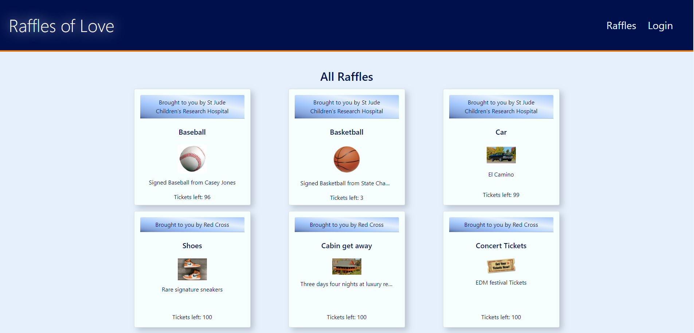
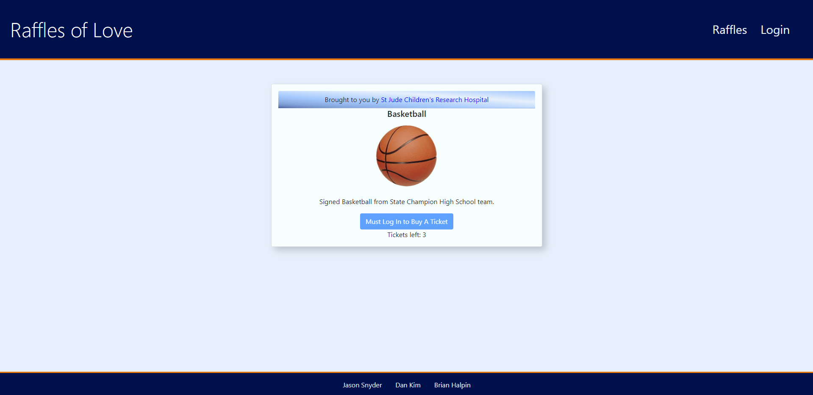
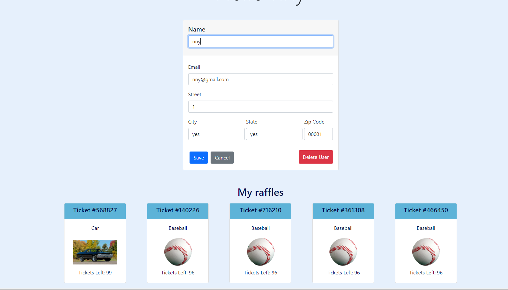
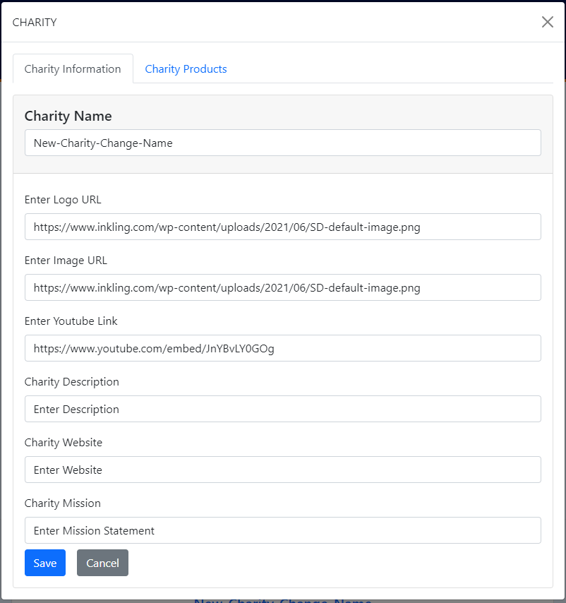
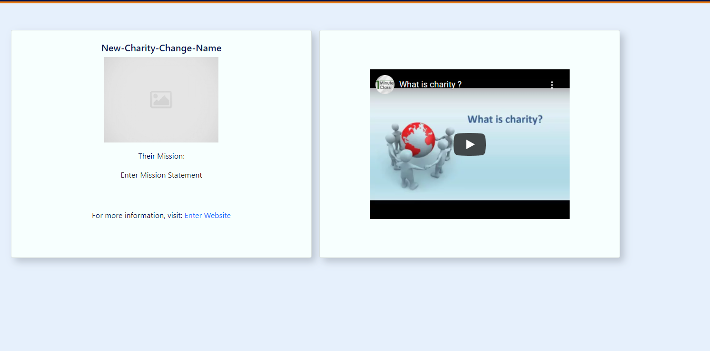

# Raffles of Love

  ## Description
  We built a raffle website that would give charities a place to raffle off donated items.  It gives people the opportunity to learn about charities they may not have known about in the past on the landing page.  Selecting a charity will show you more information on them and their items they are raffling off.  Selecting the item will take you to a page with information on the item as well as allow you to buy tickets for the item if you are logged in.  Once all of the tickets for an item are sold a random ticket will be selected and notify the winner they have won, and will notify the people without winning tickets that they did not win the raffle.  It allows for a charity to join the website and will build their page off of provided information, including raffled items.
  
  ## Table of Contents

  - [Tools](#tools)

  - [License](#license)

  - [Link](#link)

  - [Screenshots](#screenshots)

  - [Questions](#questions)
  
  ## Tools
  
 Express, React, React Bootstrap, React Router, Mongodb, graphQL, Mongoose, Stripe, Apollo, JSON Web Tokens, bcrypt
  
  
  ## License

  
  ## Link
[Live App](https://charity-raffle.herokuapp.com/)

  ## Screenshots

  ## Questions

  If you have any questions about the project please contact us at.
  - [Jason Snyder](https://github.com/Jsnyder159?tab=repositories)
  - [Brian Halpin](https://github.com/bthalpin)
  - [Dan Kim](https://github.com/danchanyoungkim)
 